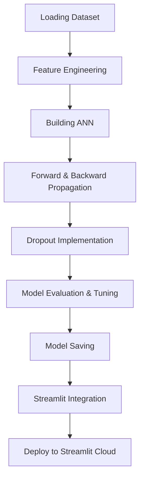

# Bank Customer Churn Prediction Using ANN

## Overview

This project aims to predict customer churn in a bank using Artificial Neural Networks (ANN). Based on input features such as **`credit_score`**, **`country`**, **`gender`**, **`age`**, **`tenure`**, **`balance`**, **`products_number`**, **`credit_card`**, **`active_member`**, and **`estimated_salary`**, the model determines whether a customer will close their account or continue their banking relationship.

## Features
- Predict customer churn effectively with an ANN model.
- Data pre-processing includes handling categorical data, missing values, and feature engineering.
- Dropout layers to prevent overfitting and improve model generalization.
- Deployment via Streamlit for a user-friendly interface.
- Model persistence using `.pickle` and `.h5` formats.

---

## Workflow

### 1. **Loading the Dataset**
   - Import and load the dataset for analysis and model building.

### 2. **Feature Engineering**
   - Handle categorical data (e.g., encoding).
   - Fill or remove missing values.
   - Scale numerical features for ANN compatibility.

### 3. **Building the ANN**
   - Input Layer: Define the number of input neurons based on features.
   - Hidden Layers: Use multiple layers with activation functions.
   - Output Layer: Use sigmoid activation for binary classification.
   - Apply forward and backward propagation.

### 4. **Implementing Dropout**
   - Add dropout layers to reduce overfitting by deactivating random neurons during training.

### 5. **Model Saving**
   - Save the trained model as a `.pickle` or `.h5` file for later use.

### 6. **Integration with Streamlit**
   - Build an interactive web application using Streamlit to allow users to input customer data and view predictions.
   - Deploy the application to Streamlit Cloud for public access.

---

## Flowchart



---

## Getting Started

### Prerequisites
- Python 3.7+
- Libraries: TensorFlow, NumPy, Pandas, Scikit-learn, Streamlit

### Installation
1. Clone the repository:
   ```bash
   git clone https://github.com/mukesh1996-ds/Bank-Churn-Modeling-using-ANN.git
   ```
2. Install dependencies:
   ```bash
   pip install -r requirements.txt
   ```

### Running the Application
1. Train the model:
   ```bash
   python train_model.py
   ```
2. Start the Streamlit app:
   ```bash
   streamlit run app.py
   ```

---
