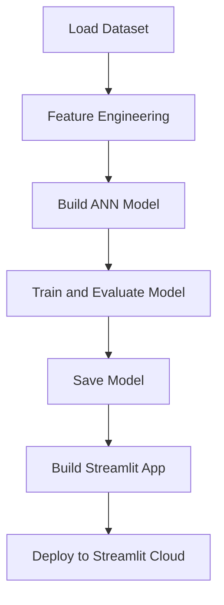
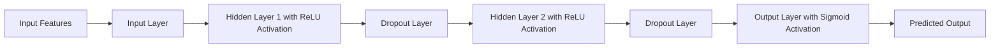

# Bank Customer Churn Prediction Using ANN

## Overview

This project aims to predict customer churn in a bank using Artificial Neural Networks (ANN). Based on input features such as **`credit_score`**, **`country`**, **`gender`**, **`age`**, **`tenure`**, **`balance`**, **`products_number`**, **`credit_card`**, **`active_member`**, and **`estimated_salary`**, the model determines whether a customer will close their account or continue their banking relationship.

## Features
- Predict customer churn effectively with an ANN model.
- Data pre-processing includes handling categorical data, missing values, and feature engineering.
- Dropout layers to prevent overfitting and improve model generalization.
- Deployment via Streamlit for a user-friendly interface.
- Model persistence using `.pickle` and `.h5` formats.

---

## Workflow

### Workflow Stages:
1. **Loading the Dataset**  
   Import and load the dataset for analysis and model building.

2. **Feature Engineering**  
   - Handle categorical data (e.g., encoding).  
   - Fill or remove missing values.  
   - Scale numerical features for ANN compatibility.  

3. **Implementation of ANN**  
   - Build a neural network with input, hidden, and output layers.  
   - Apply forward and backward propagation.  
   - Add dropout layers to avoid overfitting.  

4. **Model Training and Evaluation**  
   - Train the model on the dataset using multiple epochs.  
   - Evaluate model accuracy and tune hyperparameters.  

5. **Model Saving**  
   Save the trained model as a `.pickle` or `.h5` file for future use.  

6. **Streamlit Integration**  
   Build a Streamlit app for user interaction and deploy to Streamlit Cloud.

---

### Workflow Flow Diagram



---

## Implementation of ANN

### Definition
An Artificial Neural Network (ANN) is a computing system inspired by the human brain, consisting of layers of interconnected nodes (neurons). It processes data by applying transformations through layers to predict outputs.

### Neural Network Flow Diagram


---

## Getting Started

### Prerequisites
- Python 3.7+
- Libraries: TensorFlow, NumPy, Pandas, Scikit-learn, Streamlit

### Installation
1. Clone the repository:
   ```bash
   git clone https://github.com/mukesh1996-ds/Bank-Churn-Modeling-using-ANN.git
   ```
2. Install dependencies:
   ```bash
   pip install -r requirements.txt
   ```

### Running the Application
1. Train the model:
   ```bash
   python train_model.py
   ```
2. Start the Streamlit app:
   ```bash
   streamlit run app.py
   ```

